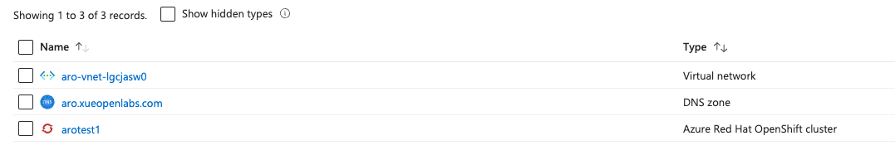
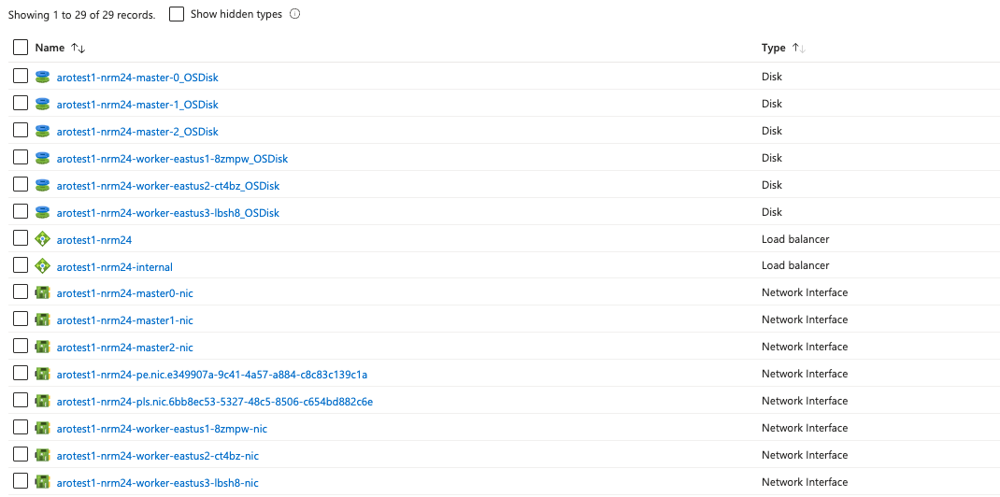
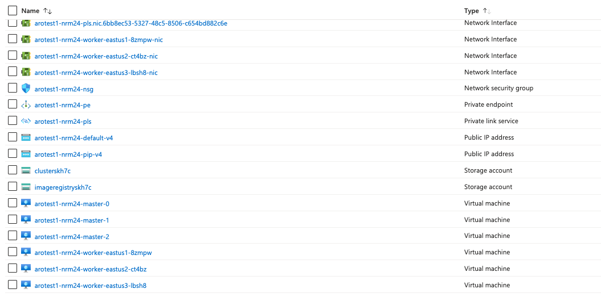
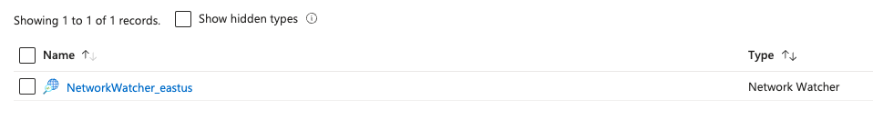
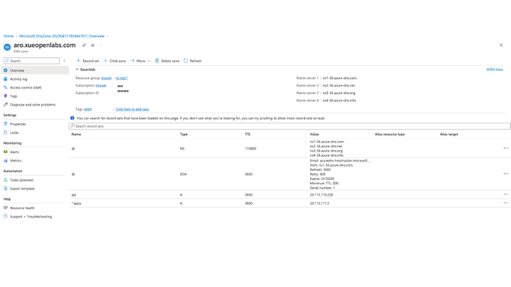
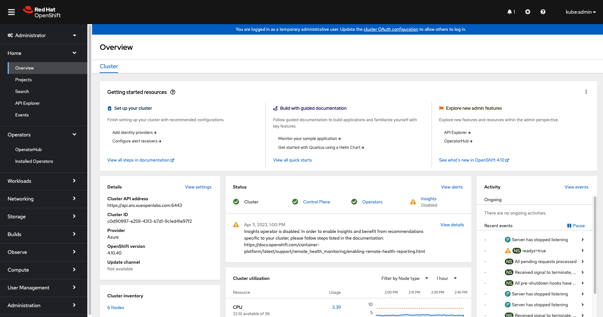

# Deploy A Public ARO Cluster with A Custom Domain Name In Azure

This document describes the steps you take to deploy a public Red Hat OpenShift cluster in Azure using a custom domain name instead of the default domain name that Azure provides.

## Create an OpenShift Cluster

Follow the steps for deploying a [Red Hat OpenShift](https://learn.microsoft.com/en-us/azure/openshift/quickstart-portal) cluster in Microsoft Azure using the portal or CLI command lines.

On the Basics tab, use an existing domain name, e.g. "aro.xueopenlabs.com".

On the Authentication tab, use an existing service principal account, including client id and client secret. Include Red Hat pull secret. If you leave it bank, you can [add or update the pull secret](https://learn.microsoft.com/en-us/azure/openshift/howto-add-update-pull-secret). Note that without the pull secret, you will see an empty screen on the OperatorHub screen in the OpenShift cluster.

On the Networking tab, select "Public" for "API server visibility" and "Ingress visibility".

The deployment takes about 30 minutes or longer to complete if no errors occur.

### ARO Resources

After a successful ARO deployment, you find two resource groups created automatically in the subscription, NetworkWatchRG and a read-only resource group named as "aro-infra" plus your cluster name.

The ARO cluster (or link) is included in the resource group you use, along with other resources such as vnet and dns zone.



The actual resources of the ARO cluster, a total of 29 of them, are stored in the read-only resource group.

ARO - resources list #1



ARO - resources list #2



One resource is created in the NetworkWatcherRG resource group.



## Obtain OpenShift Cluster Credentials and public IP Addresses

```
 az aro list-credentials --name <cluster name>  --resource-group <resource group name>
az aro show -n <cluster name> -g <resource group name> --query '{api:apiserverProfile.ip, ingress:ingressProfiles[0].ip}'
```

## Create a DNS Zone in Azure

Follow the steps to create a new [DNS Zone](https://learn.microsoft.com/en-us/azure/dns/dns-getstarted-portal) in an existing or a new resource group.

Make a note of the four name servers, including the "." at the end.
```
ns1-36.azure-dns.com.
ns2-36.azure-dns.net.
ns3-36.azure-dns.org.
ns4-36.azure-dns.info.
```

Add two A records, one for "api" and one for "*.apps" using the public IP addresses from the step above.



### Update DNS Setting in Your Domain Name Account

Update the domain or subdomain settings in your domain name account, for example, in your Google Domains account.

To use a subdomain like "aro.xueopenlabs.com", create custom records, one host and four server names you noted in the Azure DNS Zone.


### Log In to the OpenShift Cluster

Use the credentials you obtained from the step above and log in to the OpenShift cluster. Notice that your ARO cluster url includes your custom domain name.



