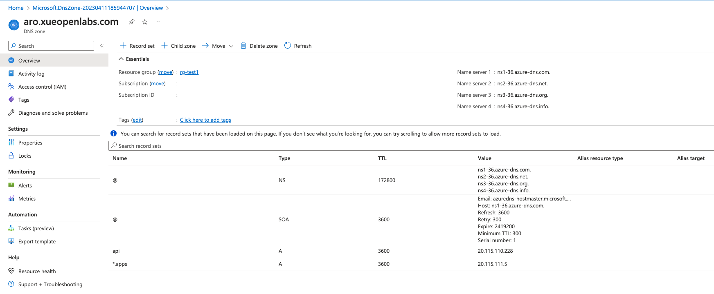
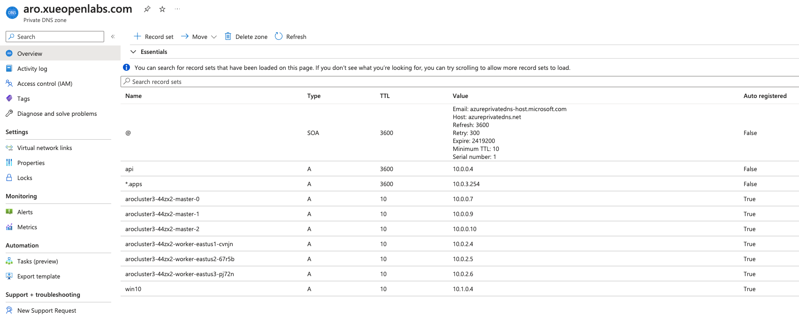
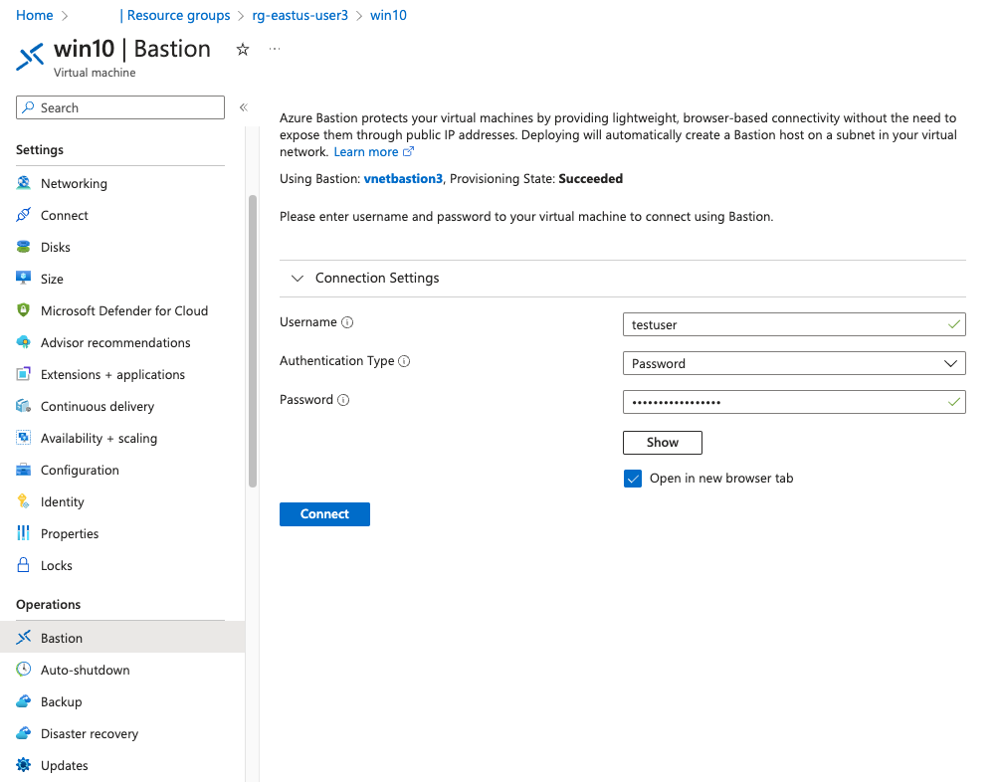
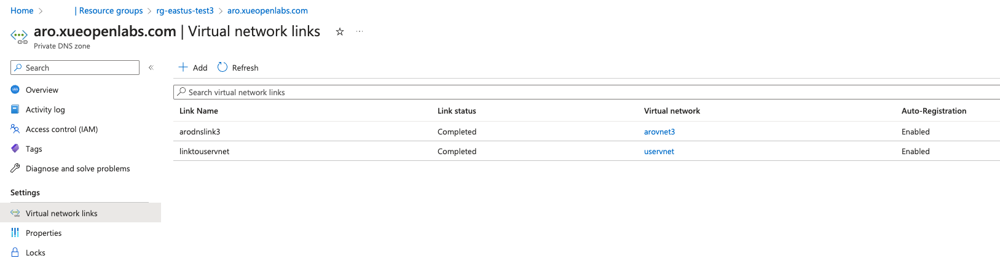

# Deploy Azure Red Hat OpenShift (ARO) Clusters with Custom Domain

This document describes the steps you take to deploy a Red Hat Azure OpenShift (ARO) cluster in Azure using a custom domain name instead of the default domain name that Azure provides. In particular, it provides details on how to configure a public cluster and a private cluster. Finally, it includes CLI scripts for creating and configuring a private ARO cluster.

## Create an OpenShift Cluster

Follow the steps for deploying a [Red Hat OpenShift](https://learn.microsoft.com/en-us/azure/openshift/quickstart-portal) cluster in Microsoft Azure using the portal or CLI command lines.

On the Basics tab, use an existing domain name, e.g. "aro.xueopenlabs.com".

On the Authentication tab, use an existing service principal account, including client id and client secret. Include Red Hat pull secret. If you leave it bank, you can [add or update the pull secret](https://learn.microsoft.com/en-us/azure/openshift/howto-add-update-pull-secret). Note that without the pull secret, you will see an empty screen on the OperatorHub screen in the OpenShift cluster.

On the Networking tab, select "Public" for "API server visibility" and "Ingress visibility". For a private cluster, select "Private".

The deployment takes about 35 minutes or longer to complete if no errors occur.

### ARO Resources

After a successful ARO deployment, you find two resource groups created automatically in the subscription, NetworkWatchRG and a read-only resource group named as "aro-infra" plus your cluster name.

The ARO cluster (or link) is included in the resource group you use, along with other resources such as vnet and dns zone.


The actual resources of the ARO cluster, a total of 29 or more, are stored in the read-only resource group.

ARO - resources list #1


ARO - resources list #2


One resource is created in the NetworkWatcherRG resource group.


## Obtain OpenShift Cluster Credentials and IP Addresses

```
az aro list-credentials --name <cluster name>  --resource-group <resource group name>
az aro show -n <cluster name> -g <resource group name> --query '{api:apiserverProfile.ip, ingress:ingressProfiles[0].ip}'
```
For a public cluster, public IP addresses for "api" and "ingress" are listed, whereas only private IP addresses are listed for a private cluster. Make a note of 

```
{
  "api": "10.0.0.4",
  "ingress": "10.0.3.254"
}
```

## Configure a Public Cluster

The steps below are for configuring a public cluster only.

### Create a DNS Zone in Azure

Follow the steps to create a new [DNS Zone](https://learn.microsoft.com/en-us/azure/dns/dns-getstarted-portal) in an existing or a new resource group.

Make a note of the four name servers, including the "." at the end.
```
ns1-36.azure-dns.com.
ns2-36.azure-dns.net.
ns3-36.azure-dns.org.
ns4-36.azure-dns.info.
```

Add two A records, one for "api" and one for "*.apps" using the public IP addresses from the step above.



### Update DNS Setting in Your Domain Name Account

Update the domain or subdomain settings in your domain name account, for example, in your Google Domains account.

To use a subdomain like "aro.xueopenlabs.com", create custom records, one host and four server names you noted in the Azure DNS Zone.


## Configure a Private Cluster

The steps below are for configuring a private cluster only.

### Create a Private DNS Zone and Add Two A Records

Follow the steps on [Create an Azure private DNS zone](https://learn.microsoft.com/en-us/azure/dns/private-dns-getstarted-portal). Name the private dns zone with your custom domain name. Link the ARO VNet to the private DNS zone. 

Add two A records, one for "api" and one for "*.apps", using the IP addresses you obtained from the step above.

The private DNS zone resolves all requests with the custom domain name to the internal load balancer (*.apps) or "api".



### Create a VM in A New VNet

Create a new resource group, VNet and subnet. Create a Windows or Linux VM using the new VNet in the new resource group. This kind of deployment is typical since new ARO clusters are created in their own resource groups. 

Make sure that IP addresses do not overlap with those for the ARO cluster. See the CLI scripts section for examples of IP ranges or CIDRs.

Optionally, create an Azure Bastion and subnet. Check [What Is Azure Bastion](https://learn.microsoft.com/en-us/azure/bastion/bastion-overview) for more details. 

You can use RDP, SSH or Azure Bastion to log in to the new VM.



### Create VNET Peerings Between the ARO VNet and the VM VNet

Follow steps on [Connect virtual networks with virtual network peering](https://learn.microsoft.com/en-us/azure/virtual-network/tutorial-connect-virtual-networks-portal).

VNET Peerings in VM VNet


VNET Peerings in ARO VNet


### Link the VM VNet to the Private DNS Zone

All requests with the custom domain name from the VM must be resolved by the Private DNS Zone. To do so, link the VM VNet to it after VNet Peerings are configured. This is an important step. Failure to do so will result networking error when you launch the OpenShift cluster admin console.



## Log In to the OpenShift Cluster

Use the credentials you obtained from the step above and log in to the OpenShift cluster. Notice that your ARO cluster url includes your custom domain name.


## Use CLI to Create a Private Cluster

The CLI scripts below create an ARO cluster. The Red Hat pull secret is stored in a text file in the directory when the CLI commands are run.

```
#Creating ARO Cluster
LABEL=3
LOCATION=eastus              
RESOURCEGROUP="rg-$LOCATION"-test"$LABEL"
CLUSTER="arocluster$LABEL"
VNETNAME="arovnet$LABEL"
MASTERSUBNET="mastersubnet$LABEL"
WORKERSUBNET="workerrsubnet$LABEL"
DOMAIN=aro.xueopenlabs.com
#MASTERVMSIZE=Standard_D8s_v3
#WORKERVMSIZE=Standard_D4s_v3
#WORKERCOUNT=3
#PULLSECRET=`cat pull-secret.txt`

az group create --name $RESOURCEGROUP --location $LOCATION

az network vnet create \
--resource-group $RESOURCEGROUP \
--name $VNETNAME \
--address-prefixes 10.0.0.0/22

az network vnet subnet create \
--resource-group $RESOURCEGROUP \
--vnet-name $VNETNAME \
--name $MASTERSUBNET \
--address-prefixes 10.0.0.0/23 \
--service-endpoints Microsoft.ContainerRegistry

az network vnet subnet create \
--resource-group $RESOURCEGROUP \
--vnet-name $VNETNAME  \
--name $WORKERSUBNET \
--address-prefixes 10.0.2.0/23 \
--service-endpoints Microsoft.ContainerRegistry

az network vnet subnet update \
--name $MASTERSUBNET \
--resource-group $RESOURCEGROUP \
--vnet-name $VNETNAME \
--disable-private-link-service-network-policies true

az aro create \
  --resource-group $RESOURCEGROUP \
  --name $CLUSTER \
  --vnet $VNETNAME \
  --master-subnet $MASTERSUBNET  \
  --worker-subnet $WORKERSUBNET  \
  --apiserver-visibility Private \
  --ingress-visibility Private \
  --domain $DOMAIN \
  --pull-secret @pull-secret.txt 


az aro list-credentials \
  --name $CLUSTER \
  --resource-group $RESOURCEGROUP

az aro show -n $CLUSTER -g $RESOURCEGROUP  \
--query '{api:apiserverProfile.ip, ingress:ingressProfiles[0].ip}'

az aro show \
    --name $CLUSTER \
    --resource-group $RESOURCEGROUP \
    --query "consoleProfile.url" -o tsv

```

The CLI scripts below create Private DNS Zone.

```
VNETLINK="arodnslink$LABEL" 

# Create Private DNS Zone
az network private-dns zone create -g $RESOURCEGROUP -n $DOMAIN 

az network private-dns link vnet create -g $RESOURCEGROUP -n $VNETLINK -z $DOMAIN -v $VNETNAME -e true

az network private-dns record-set a add-record \
  -g $RESOURCEGROUP \
  -z $DOMAIN  \
  -n api \
  -a 10.0.0.4

az network private-dns record-set a add-record \
  -g $RESOURCEGROUP \
  -z $DOMAIN  \
  -n "*.apps" \
  -a 10.0.3.254
```

The CLI scripts below create a resource group, a VM, a VNET and Azure Bastion.

```
RESOURCEGROUP2="rg-$LOCATION"-user"$LABEL"
VMNAME="vmtest$LABEL" 
VMIMAGENAME=UbuntuLTS
USERNAME=testuser
PWD=xxxxxxxx

VNETNAME2=uservnet
SUBNET2=default
VNETPEERING1=vnet1tovnet2
VNETPEERING2=vnet2tovnet1
IPADDRESS="$VMNAME"-ip
BASTIONNAME="vnetbastion$LABEL"
BASTIONSUBNET=azurebastionsubnet

az group create --name $RESOURCEGROUP2 --location $LOCATION

az network vnet create \
  --name $VNETNAME2 \
  --resource-group $RESOURCEGROUP2 \
  --address-prefix 10.1.0.0/16 \
  --subnet-name $SUBNET2 \
  --subnet-prefixes 10.1.0.0/24

# Create subnet for Azure Bastion
az network vnet subnet create \
  --name $BASTIONSUBNET \
  --resource-group $RESOURCEGROUP2  \
  --vnet-name $VNETNAME2 \
  --address-prefix 10.1.1.0/26 

# Create public IP address for Azure Bastion
az network public-ip create \
--resource-group $RESOURCEGROUP2  \
--name $IPADDRESS --sku Standard --location $LOCATION

# Create Azure Bastion
az network bastion create \
  --name $BASTIONNAME \
  --public-ip-address $VMIPADDRESS  \
  --resource-group $RESOURCEGROUP2  \
  --vnet-name $VNETNAME2
 --location $LOCATION

 az vm create \
  --resource-group $RESOURCEGROUP2 \
  --name $VMNAME \
  --image $VMIMAGENAME \
  --admin-username $USERNAME \
  --admin-password $PWD \
  --vnet-name $VNETNAME2 \ 
  --subnet $SUBNET2 \ 
 --generate-ssh-keys

```

The CLI scripts below create VNet Peerings.

```
VNETLINK2=linktouservent

# Get the id for ARO VNet
vNet1Id=$(az network vnet show \
  --resource-group $RESOURCEGROUP \
  --name $VNETNAME \
  --query id --out tsv)

# Get the id for VM VNet
vNet2Id=$(az network vnet show \
  --resource-group $RESOURCEGROUP2 \
  --name $VNETNAME2 \
  --query id \
  --out tsv)

# Create two-way VNET Peerings
az network vnet peering create -g $RESOURCEGROUP -n $VNETPEERING1 --vnet-name $VNETNAME --remote-vnet  $vNet2Id --allow-vnet-access
az network vnet peering create -g $RESOURCEGROUP2 -n $VNETPEERING2 --vnet-name $VNETNAME2 --remote-vnet  $vNet1Id --allow-vnet-access

# Link VM VNet to Private DNS Zone
az network private-dns link vnet create -g $RESOURCEGROUP -n $VNETLINK2 -z $DOMAIN -v $VNETNAME -e true
```
